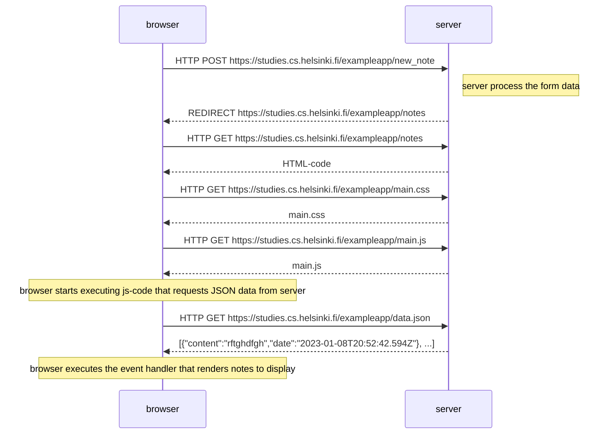

```mermaid

sequenceDiagram

browser->>server: HTTP POST https://studies.cs.helsinki.fi/exampleapp/new_note
Note right of server: server process the form data

server-->>browser: REDIRECT https://studies.cs.helsinki.fi/exampleapp/notes
browser->>server: HTTP GET https://studies.cs.helsinki.fi/exampleapp/notes
server-->>browser: HTML-code
browser->>server: HTTP GET https://studies.cs.helsinki.fi/exampleapp/main.css
server-->>browser: main.css
browser->>server: HTTP GET https://studies.cs.helsinki.fi/exampleapp/main.js
server-->>browser: main.js

Note over browser: browser starts executing js-code that requests JSON data from server 

browser->>server: HTTP GET https://studies.cs.helsinki.fi/exampleapp/data.json
server-->>browser: [{"content":"rftghdfgh","date":"2023-01-08T20:52:42.594Z"}, ...]

Note over browser: browser executes the event handler that renders notes to display


```