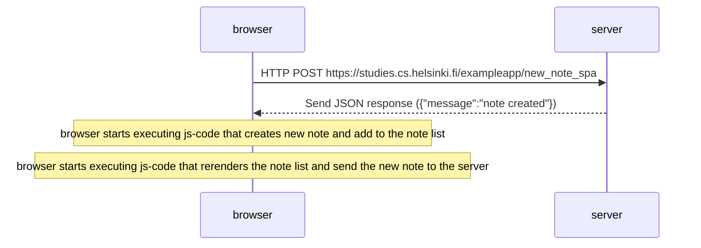

```mermaid

sequenceDiagram

browser->>server: HTTP POST https://studies.cs.helsinki.fi/exampleapp/new_note_spa
server-->>browser: Send JSON response ({"message":"note created"})

Note over browser: browser starts executing js-code that creates new note and add to the note list

Note over browser: browser starts executing js-code that rerenders the note list and send the new note to the server

```